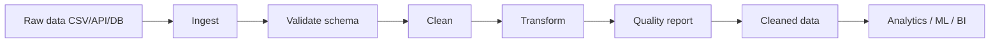

# Data Cleaning Skill

Template Python thực tế cho data pipeline và data cleaning. Hỗ trợ CSV/Parquet, tạo báo cáo chất lượng dữ liệu và xuất dữ liệu sạch.

## Sơ đồ pipeline



## Cài đặt

```bash
python -m venv .venv
source .venv/bin/activate  # Windows: .venv\\Scripts\\activate
pip install -r requirements.txt
pip install -e .
```

## Chạy pipeline

```bash
data-clean --input data/raw/input.csv --output data/processed/cleaned.csv --report reports/quality.json --config configs/default.yaml
```

## Các bước hỗ trợ

- Missing values: `median`, `mean`, `mode`, `constant`, `drop`.
- Format: chuẩn hóa tên cột, ngày tháng, số và text.
- Typo: thay thế theo dictionary domain-specific.
- Duplicates: xóa bản ghi trùng theo toàn bộ cột hoặc subset.
- Outlier: phát hiện theo IQR; `clip` hoặc `drop`.
- Quality report: row count, missing rate, duplicate count và thay đổi.

Với dữ liệu mất cân bằng, hãy resample chỉ trên tập train sau khi chia train/validation/test để tránh data leakage.

## Test

```bash
pytest -q
```
